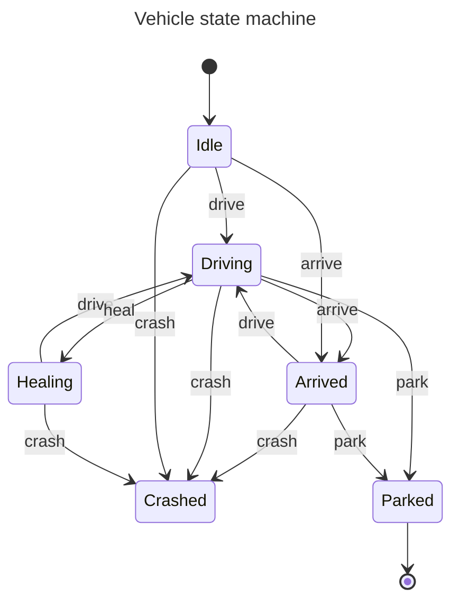

# State machine

This file describes the vehicle state machine.
It uses [MermaidJS](https://mermaid.js.org/) to display the diagram.

For convenience, epsilon transitions and crashed state are not included in the diagram.

